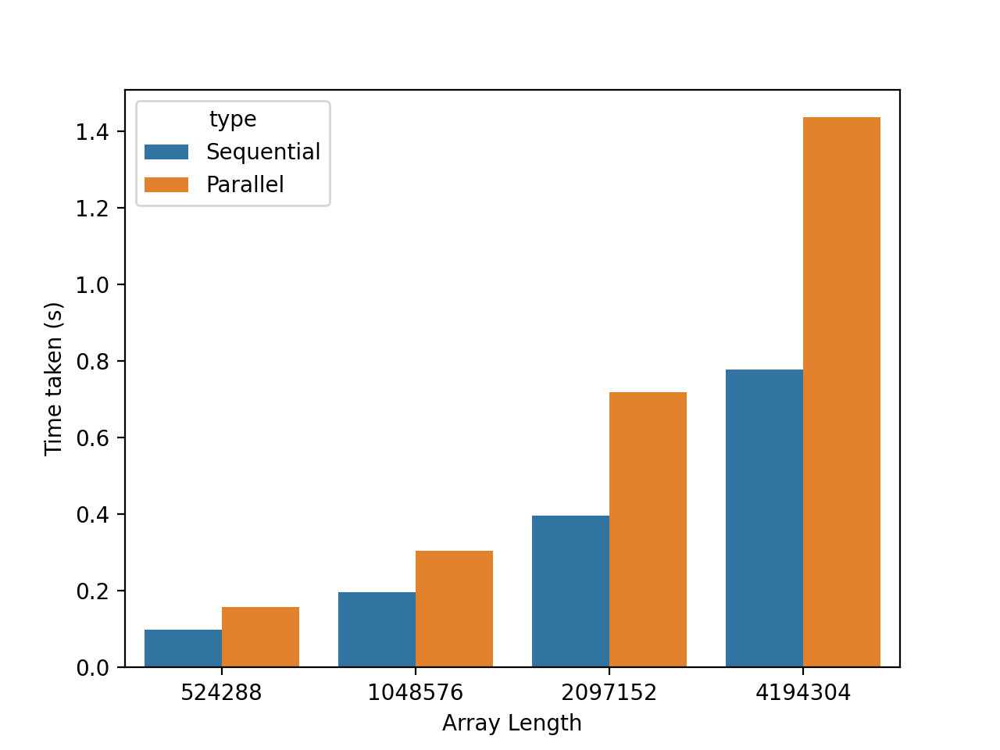

# Concurrency Lab 1

> If you're stuck look at examples on [Go by Example](https://gobyexample.com/)

## Using the lab sheet

There are two ways to use the lab sheet, you can either:

- [create a new repo from this template](https://github.com/UoB-CSA/concurrency-lab-1/generate) - **this is the recommended way**
- download a [zip file](https://github.com/UoB-CSA/concurrency-lab-1/archive/master.zip)

Each question is rated to help you balance your work:

- :red_circle::white_circle::white_circle::white_circle::white_circle: - Easy, strictly necessary.
- :red_circle::red_circle::white_circle::white_circle::white_circle: - Medium, still necessary.
- :red_circle::red_circle::red_circle::white_circle::white_circle: - Hard, necessary if you're aiming for higher marks.
- :red_circle::red_circle::red_circle::red_circle::white_circle: - Hard, useful for coursework extensions.
- :red_circle::red_circle::red_circle::red_circle::red_circle: - Hard, beyond what you need for any part of the coursework.

## Question 1 - Median Filter :red_circle::red_circle::white_circle::white_circle::white_circle:

> This lab has been designed to take **two weeks**. You are encouraged to focus on Q1 in the first week, and Q2 in the second week.

Open the images in the `filter` directory. As you can see, they all have 'salt and pepper' noise. Now open `medianFilter.go`. It's a single-threaded implementation of a Median Filter, which removes the salt and pepper noise. It runs through the image pixel by pixel and replaces each value with the median of neighbouring values. In this implementation, the algorithm has hardcoded radius 2 and therefore it looks at 24 neighbours (as well as its own value).

### Question 1a

```bash
Usage of ./filter:
  -in string
    	Specify the input file. (default "ship.png")
  -out string
    	Specify the output file. (default "out.png")
  -threads int
    	Specify the number of worker threads to use. (default 1)
```
For example:

```bash
  go run . -in="sion_0.02.png"
 ```
 or:
 
```bash
  go build
  ./filter -in="sion_0.02.png"
 ```
 

Read the source code, run the filter on the provided images and verify that the noise has been removed.

Make sure you run this program using either `go build` or `go run .` IDE autorun tools may not read the image files correctly.

### Question 1b

The median filter is an example of a problem that is "embarrassingly parallelisable" Consider having 4 worker threads. We could split the image into 4 parts and ask each worker to process their chunk in parallel to other workers. At the end, we can collect the result and output the final image.

Your task will be to write code that supports 2, 4, 8 and 16 worker threads.

#### Sending

The first problem we encounter when parallelising is how to send the workers their respective chunks of the image:

We *could* use channels of type `chan [][]uint8` to send parts of the image to the worker as pure 2D slices. For example using the notation `image[0:128]`. This is not a good solution. Recall from lab 1 that passing a slice to a function simply passes a pointer. If we passed the same slice to multiple workers we could end up concurrently modifying the slice causing an incorrect resulting image.

We *could* use channels of type `chan uint8` to pass `uint8` values one by one, rather than slices. While this is a valid and safe solution, it isn't particularly fast.

Instead, today we will explore how to create a *closure* that will make our slice immutable.

The variable `immutableData` in the function `filter()` is a closure. It is **not** a slice or any other data type. The function `makeImmutableMatrix(...)` returns a function. It stores a reference to a 2D slice and given `y` and `x` coordinates it returns a `uint8` from the slice that it wraps. Such a function with hidden state is called a [closure](https://gobyexample.com/closures). This mechanism is similar to an object with a getter in java.

The use of a closure means that the slice it wraps effectively becomes immutable. As a programmer, you now have no direct access to the pointer and therefore no way of modifying the slice. This will allow us to pass the closure to multiple goroutines without causing any potential [race conditions](https://en.wikipedia.org/wiki/Race_condition) since concurrent read operations are perfectly safe - concurrent writes or reads when a write may be happening almost always aren't.

#### Receiving

The second problem is receiving and reconstructing the image back in the function `filter()`:

We *could* use channels of type `chan uint8` to pass `uint8` values one by one. While this is a valid and safe solution, it isn't particularly fast.

We *could* use a channel of type `chan func(y, x int) uint8` to send back a closure. However, to put together the final image in a single 2D slice we will need to use `append`, which is not supported by a closure. We would, therefore, end up extracting the `uint8` values one by one which is slow.

Our solution will use a channel of type `chan [][]uint8` to send the resulting image back to `filter()`. We will send a slice (~pointer) over a channel, but in this case, there are no race conditions, because the worker exits immediately after sending the slice. This does not invalidate the memory (like it could in C). As a result, the slice will only be owned by a single goroutine (the `filter()` one) and there will be no race conditions.

#### Task

Start parallelising the median filter by creating a `worker(...)` function. Given a closure and some y and x bounds it should apply the median filter between these bounds and 'return' the newly created slice.

<details>
    <summary>Hint 1</summary>

The signature of the worker function could be:

```go
func worker(startY, endY, startX, endX int, data func(y, x int) uint8, out chan<- [][]uint8) {

}
```

</details>

<details>
    <summary>Hint 2</summary>

You only need two lines of code in the worker. One to execute the median filter and one to send the resulting slice back on the `out` channel.

</details>

### Question 1c

Now that we've created a worker we need to change how `filter()` works. It needs to distribute the image between the correct number of workers, wait for them to finish, and then reconstruct the image in a single 2D slice so that it can be saved to a file.

Change `filter()` so that if more than 1 worker is requested:

- It starts the requested number of workers with the `go` keyword (using a for loop).
- It collects the resulting parts into a single 2D slice (using a for loop and `append`).

Your solution needs to work with 2, 4, 8 and 16 workers. You only need to support the `ship.png` input image.

<details>
    <summary>Hint 1</summary>

You may find it helpful to start by hardcoding 4 worker threads - and then expanding to support 2, 8 and 16.

</details>

<details>
    <summary>Hint 2</summary>

Each worker needs a channel to send their output. In case of 4 workers, you need to create a slice of 4 channels - one for each worker.

You need to make a slice of type `[]chan [][]uint8` and then, in a for loop, make individual channels of type `chan [][]uint8`.

</details>

<details>
    <summary>Hint 3</summary>

In case of 4 workers, you will need to start 4 worker goroutines using the `go` command. For an image of size 512x512 (such as `ship.png`) they need to work on following y-coordinates:

- Worker 1: 0-128
- Worker 2: 128-256
- Worker 3: 256-384
- Worker 3: 384-512

x-coordinates would be 0-512 for all workers

(The ranges here are same as for the slices - e.g for range 128-256, 128 is included but 256 isn't.)

</details>

<details>
    <summary>Hint 4</summary>

To reconstruct the image in a single 2D slice you can collect all the parts from the workers and use `append` to attach the matrices together. E.g.:

```go
newData = append(newData, part...)
```

Where both `newData` and `part` are 2D slices. Note that `...` is part of the syntax.

</details>

Run the filter with different values for the `-threads` flag and make sure the resulting images are all correct. They should look like this:


### Question 1d

When parallelising, our main aim is to make the processing faster. Using benchmarks you can measure just how fast your program is. A benchmark can be considered to be a type of test. In a unit test the result is pass or fail. In a benchmark, the result is the time taken to execute it. Unit tests allow us to check correctness, benchmarks can be used to measure and compare performance.

There is one benchmark function defined for you in `medianFilter_test.go`. To run this benchmark in Go use the command `go test -bench .`. Example results for the median filter are below:

```bash
BenchmarkFilter/1_workers-8         	       3	 377014480 ns/op
BenchmarkFilter/2_workers-8         	       5	 218908324 ns/op
BenchmarkFilter/4_workers-8         	       7	 144866283 ns/op
BenchmarkFilter/8_workers-8         	       9	 124873239 ns/op
BenchmarkFilter/16_workers-8        	       9	 121746826 ns/op
```

The benchmark function we defined runs 5 sub benchmarks. Each line of the output represents one sub-benchmark. For example:

```
BenchmarkFilter/4_workers-8         	       7	 144866283 ns/op
```

- `BenchmarkFilter` is the name of the main benchmark function.
- `4_workers` is the name of the sub-benchmark. Our benchmark function runs 5 sub-benchmarks, each with a different number of worker threads.
- `8` is the number of logical cores of your CPU.
- `7` is the number of times this sub-benchmark was repeated to obtain a stable result. Here it was automatically decided by the Go runtime, later we will learn how to change this ourselves.
- `144866283` is the average time taken to run this sub-benchmark (*not* the total time to run 7 iterations). This is always reported in nanoseconds. It's often useful to convert this back to seconds.

We will now use benchmarks to determine the performance improvement associated with adding more worker threads. We will use Python to visualise the results. First, we need to setup the required Go and Python libraries. **We recommend doing this on a lab machine.** We will *not* be helping you with Python installations on your local machines.

Download the `benchstat` Go library.

```
GO111MODULE=off go get golang.org/x/perf/cmd/benchstat
```

If you are working on a lab machine, active the Python 3 Anaconda environment.

```
module add anaconda/2020.07
```

*(You can also install Anaconda on your own machine by following the [official guide](https://www.anaconda.com/products/individual). This will install the required dependencies: seaborn, numpy, matplotlib and pandas.)*

We are now ready to run our Median Filter benchmark. This time we will use two new flags. This will repeat each sub-benchmark 5 times, but each result will be reported individually.

```
go test -run ^$ -bench . -benchtime 1x -count 5 | tee results.out
```

The results should look like this.

```
BenchmarkFilter/1_workers-12         	       1	 294462262 ns/op
BenchmarkFilter/1_workers-12         	       1	 293813452 ns/op
BenchmarkFilter/1_workers-12         	       1	 293680576 ns/op
BenchmarkFilter/1_workers-12         	       1	 294184722 ns/op
BenchmarkFilter/1_workers-12         	       1	 295367359 ns/op
BenchmarkFilter/2_workers-12         	       1	 171195123 ns/op
BenchmarkFilter/2_workers-12         	       1	 172171790 ns/op
BenchmarkFilter/2_workers-12         	       1	 171684903 ns/op
BenchmarkFilter/2_workers-12         	       1	 171855058 ns/op
BenchmarkFilter/2_workers-12         	       1	 190077089 ns/op
BenchmarkFilter/4_workers-12         	       1	 137330430 ns/op
BenchmarkFilter/4_workers-12         	       1	 117784086 ns/op
BenchmarkFilter/4_workers-12         	       1	 125862648 ns/op
BenchmarkFilter/4_workers-12         	       1	 124865701 ns/op
BenchmarkFilter/4_workers-12         	       1	 121237712 ns/op
BenchmarkFilter/8_workers-12         	       1	  98534965 ns/op
BenchmarkFilter/8_workers-12         	       1	 127489070 ns/op
BenchmarkFilter/8_workers-12         	       1	  97566680 ns/op
BenchmarkFilter/8_workers-12         	       1	  98990243 ns/op
BenchmarkFilter/8_workers-12         	       1	 136017044 ns/op
BenchmarkFilter/16_workers-12        	       1	  89829133 ns/op
BenchmarkFilter/16_workers-12        	       1	 134415442 ns/op
BenchmarkFilter/16_workers-12        	       1	 121134810 ns/op
BenchmarkFilter/16_workers-12        	       1	  89106639 ns/op
BenchmarkFilter/16_workers-12        	       1	  91232779 ns/op
```

We can now use our `benchstat` library to convert raw benchmark output to a 'Comma Separated Values' (CSV) file.

```
go run golang.org/x/perf/cmd/benchstat -csv results.out | tee results.csv
```
If this produces no output, try opening your results.out with text editor (Notepad) and then saving as utf-8 encoding.

The output should look like this.

```
name,time/op (ns/op),±
Filter/1_workers-12,2.94302E+08,0%
Filter/2_workers-12,1.71727E+08,0%
Filter/4_workers-12,1.25416E+08,9%
Filter/8_workers-12,1.11720E+08,22%
Filter/16_workers-12,1.05144E+08,28%
```

Finally, we are ready to plot a bar chart of our results using Python.

```
python plot.py
```

You should see a bar chart similar to this.


### Question 1e

Write about 200 words explaining and analysing how your Median Filter implementation scales as more workers are used.

It is not enough to state what you have done. Remember that you are trying to demonstrate your in-depth understanding. You must explain *why* the effect your are observing occurs. Use your knowledge of concurrency and computer architecture to do this.

### Question 1f

Use the code from `main()` in `ping.go` (lab2 in week 1) to generate a trace of your parallel filter. Verify that the filter is processing the image via the worker goroutines.

### **OPTIONAL** Question 1g

Go has built-in support for collecting CPU execution profiles. Collect a CPU profile of your median filter. Use the results to understand which functions take the longest to execute. Explain why the filter execution time *doesn't* halve when number of workers is doubled.

```
$ go test -bench /8_ -benchtime 1x -count 20 -cpuprofile cpu.prof
$ go tool pprof -pdf -nodefraction=0 -unit=ms cpu.prof
```

### **OPTIONAL** Question 1h

If your processed images have black lines like the ones we have shown above it is because you divided the original input image exactly into the number of parts required. For each given pixel of the image, the filter needs neighbours in radius 2 - e.g. given bounds 0-128 it will only process pixels in bounds 2-126.

Fix your code so that the resulting images look the same as it used to with the single-threaded filter.

### **OPTIONAL** Question 1i

Go traces are quite powerful. You can define tasks and regions in your code and log messages.

Read [this article](https://medium.com/@felipedutratine/user-defined-runtime-trace-3280db7fe209) and experiment with logging messages, and defining tasks and regions in either your filter or ping-pong program. The trace generated from the example program from the article looks like this:

(note the Say Hello task, and sayHello/sayGoodbye regions in the 2 goroutines)


Try to achieve something similar in `ping.go` or `medianFilter.go`.

## Question 2 - Parallel tree reduction :red_circle::red_circle::red_circle::white_circle::white_circle:

So far we explored concurrency with only a handful of goroutines. In this question, you will try using a very large number of goroutines and you will analyse any costs and benefits of doing so. For example, the trace below illustrates over 8000 goroutines working on sorting a slice of size 10,000,000:


### Question 2a

Open `merge.go`. It's a working merge sort program. Your task will be to parallelise the merge sort in the `parallelMergeSort()` function.

Write a parallel merge sort that creates 2 new goroutines at each split point. Run the `main()` function and verify that the printed slice is correctly sorted.

*Note 1:* If you wish to modify the signature of the `parallelMergeSort()` function, make sure you also modify the calls to that function that happen in `merge_test.go`.

*Note 2:* Doing parallel merge sort on a slice will involve concurrent writes. Normally, this is not recommended. However, in this particular problem, each goroutine will have own section of the slice to work on. Hence passing the slice is correct but still very bug-prone. You have to make sure that there is no overlap between the sections that the goroutines are working on. We provided you with the `merge()` function which was carefully written to avoid bugs and race conditions.

<details>
    <summary>Hint 1</summary>

Start by copying the sequential merge sort into `parallelMergeSort()`.

</details>

<details>
    <summary>Hint 2</summary>

You have to wait for both workers to finish before calling `merge(...)`. This can be done using channels of type `chan bool` or with [WaitGroups](https://gobyexample.com/waitgroups).

</details>

### Question 2b

Now compare your parallel implementation against the sequential one. We provided you with benchmarks as well as a slightly modified Python script. Use them to to plot a bar chart of Array Length against Time.

### Question 2c

<details>
    <summary>Click here to see our bar chart</summary>



</details>

You may have noticed that the parallel version is slower than the sequential one! While goroutines are quite lightweight, this experiment shows that they still have an associated overhead. We can make the parallel merge sort faster by reducing the number of goroutines created.

Firstly, at every split, only one new goroutine is needed rather than two. This concept is illustrated below. It's a parallel tree reduction where the operation is addition (rather than a merge sort) on 8 elements.

*Note:* Although the animation shows 8 threads for clarity all odd threads are redundant as they only pass a message to a thread to their left and don't perform any computation.


Run benchmarks and analyse the performance of your new algorithm. Given a slice of size `n` state how many goroutines your first version would've used and how many your new version now uses.

<details>
    <summary>Hint</summary>

When splitting right start a new goroutine. When splitting left, do a simple recursive function call. Make sure you do the splitting in that order (new goroutine first and function call second).

</details>

### Question 2d

Modify your `parallelMergeSort()` so that below a certain length of the slice it stops spawning new goroutines and instead calls the sequential `mergeSort()`.

Experiment with different thresholds and try to empirically find an optimal one that provides the biggest speed-up.

You should use benchmarks and plot graphs to find the optimal value.


<details>
    <summary>Hint 1</summary>

Fix the array length to `1 << 22` (4194304).

Vary the size of the limit from `1` to `1 << 22`, doubling the limit on each iteration.

Plot bar charts of Limit against Time and find the most appropriate limit.

</details>


<details>
    <summary>Hint 2</summary>

If you define your sub-benchmark name as `fmt.Sprintf("%d_%d", size, limit)`, you can extract the limit length in Python using:

```python
benchmark_data['limit'] = benchmark_data['name'].str.extract('_(\d+)')
```

</details>


<details>
    <summary>Our analysis...</summary>


In our experiments on an 8 core machine we have found that for an array of length `1 << 22` (4194304), limits between `1 << 9` (512) and `1 << 19` (524288) performed very well, with small differences likely due to noise. The limit of `1 << 13` (8192) seems like the best candidate. The Intel Core i5 processor that we ran the merge sort on has one block of 32KiB L1 cache for each core. This means we can fit exactly 8192 32-bit integers in that space. However, to make this conclusion, we would need to measure performance more thoroughly, especially with different array sizes.

Our results are presented below. Yours may be quite different, due to differences in implementation and hardware as well as random noise.

Thresholds lower than the optimum (left side of the graph) cause a bottleneck due to goroutine creation and communication. Thresholds greater than the optimum (right side of the graph) cause more cache misses and eventually reduce the level of parallelism. When the limit is equal to the size of the initial slice the algorithm stops being parallel.


</details>
